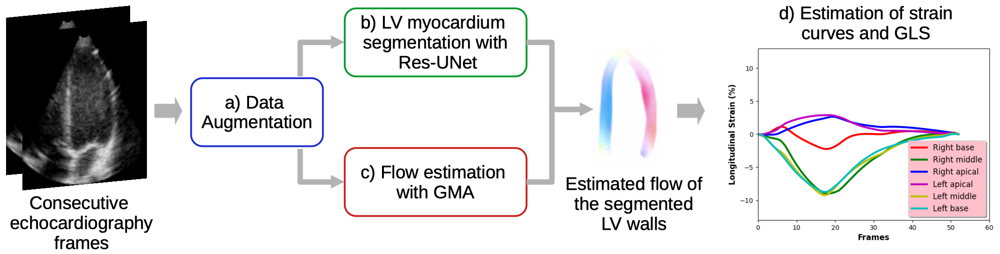

# Deep Learning-Based Estimation of Left Ventricle Myocardial Strain from Echocardiograms with Occlusion Artifacts
This a repository to reproduce the results reported in the paper:<br/>
Deep Learning-Based Estimation of Left Ventricle Myocardial Strain from Echocardiograms with Occlusion Artifacts
<br/>
EMBC 2022<br/>
Alan Romero-Pacheco; Nidiyare Hevia-Montiel;  Blanca Vazquez; Fernando Arámbula Cosío; Jorge Perez-Gonzalez<br/>



## Start locally

Environment setup

```bash
  conda env create -f environment.yml
  conda activate gma
```

Download [data](https://drive.google.com/file/d/133ryluTjygAa4fEWNEal2YgelweHmbY1/view?usp=sharing)
```bash
  ./get_data.sh
```
Reproduce evaluation results
```bash
  python strain.py
```
Reproduce strain graphics
```bash
  python strain_viz.py
```

## Acknowledgement
Huge shoutout goes to @zacjiang. The overall code is adapted from [GMA respository](https://github.com/zacjiang/GMA).
